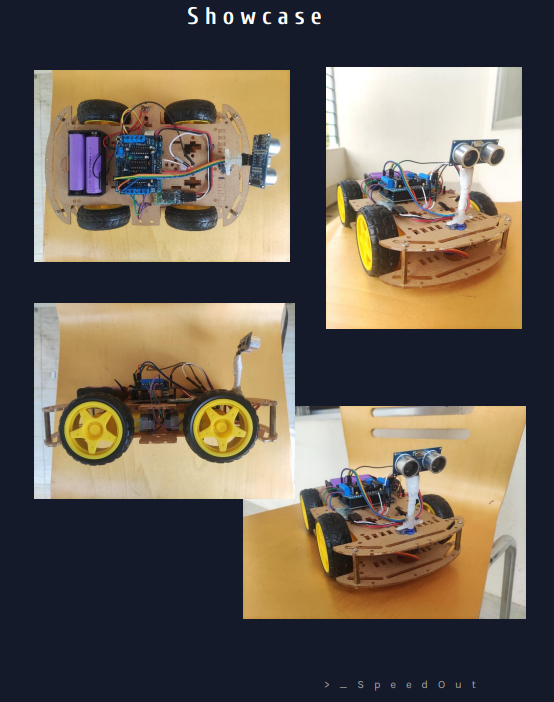

# Obstacle Avoiding Multi-purpose Arduino Robot Car
This obstacle avoiding Arduino RC, made with Arduino and Ultrasonic Sensors. It is main features include avoiding obstacles up to 15  Centimeter, which can be swapped for being a remote-controlled car controllable by a phone remote. Nearby object detecting is done by using  an ultrasonic sensor, which uses ultrasonic sound waves to measure the distance to an object by measuring how long would it take the sound/pulse to bounce off of a nearby object and return to the sensor.

Daffodil International University Digital Electoral lab project CSE224

# Showcase

# Team - SpeedOut
* [Biplob Kumar Sutradhar 203-15-3923](https://biplobsd.github.io)
* Arnob Dey 203-15-3906
* Mahian Islam Sadim 203-15-3898
* Md. Mehedi Hasan 203-15-3911
* Md. Zonaid 203-15-3927

# Detail Report
[Lab Project.pdf](assets/Lab%20Project.pdf)